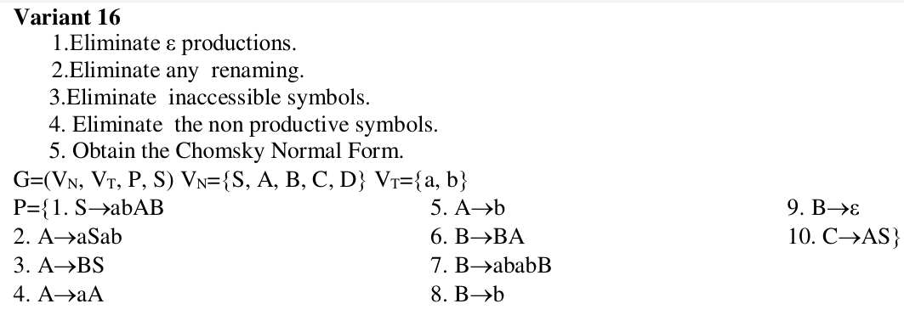

# Topic: Regular expressions

### Course: Formal Languages & Finite Automata
### Author: Istrati Daniel

----
## Theory

&ensp;&ensp;&ensp; Chomsky Normal Form (CNF) is a way of representing context-free grammars (CFGs) in a specific form, 
named after the renowned linguist and cognitive scientist Noam Chomsky. It has several important properties that make it 
useful for theoretical analysis and practical applications in areas such as natural language processing and parsing 
algorithms. Here's a breakdown of the key aspects of CNF:

1. Formal Definition: In Chomsky Normal Form, every production rule of the grammar is in one of two forms:
   - A → BC
   - A → a
   where A, B, and C are non-terminal symbols, and a is a terminal symbol. The production A → ε (where ε represents the 
   empty string) is allowed only if the start symbol appears on the right-hand side of a production.

2. Non-terminal Usage: In CNF, each non-terminal symbol (except for the start symbol, which can produce ε) must derive 
at least one string of terminal symbols.

3. Simplification: The removal of useless symbols and unproductive rules is often done before converting a grammar to 
CNF. Useless symbols are those that cannot be reached from the start symbol, and unproductive rules are those that 
cannot derive any terminal string.

4. Advantages:
   - CNF simplifies the structure of the grammar, making it easier to analyze and process.
   - It facilitates certain parsing algorithms, such as the CYK (Cocke-Younger-Kasami) algorithm, 
   which operates efficiently on grammars in CNF.
   - CNF helps in proving various properties of context-free languages, such as closure properties.

5. Conversion: Any context-free grammar can be converted to an equivalent grammar in Chomsky Normal Form. 
The process typically involves several steps, including:
   - Eliminating ε-productions
   - Eliminating unit productions (productions of the form A → B)
   - Eliminating productions with more than two non-terminals on the right-hand side
   - Introducing new non-terminals as necessary

----
## Objectives:

1.	Learn about Chomsky Normal Form (CNF)

2.	Get familiar with the approaches of normalizing a grammar.

3.	Implement a method for normalizing an input grammar by the rules of CNF.

4.	The implementation needs to be encapsulated in a method with an appropriate signature (also ideally in an appropriate class/type).

5.	The implemented functionality needs executed and tested.

6.	A BONUS point will be given for the student who will have unit tests that validate the functionality of the project.

7.	Also, another BONUS point would be given if the student will make the aforementioned function to accept any grammar, not only the one from the student's variant.

## Variant 16:



----
## Code
First of all, I define a class with constructor for grammar. Also, it will have methods for step-by-step obtaining the 
CNF, like RemoveEpsilon, EliminateUnit, EliminateInaccesible, EliminateUnprod and TransformToCNF

```commandline
    def RemoveEpsilon(self):
        nt_epsilon = []
        for key, value in self.P.items():
            s = key
            productions = value
            for p in productions:
                if p == 'eps':
                    nt_epsilon.append(s)

        for key, value in self.P.items():
            for ep in nt_epsilon:
                for v in value:
                    prod_copy = v
                    if ep in prod_copy:
                        for c in prod_copy:
                            if c == ep:
                                value.append(prod_copy.replace(c, ''))

        P1 = self.P.copy()
        # remove eps prod from copy
        for key, value in self.P.items():
            for v in value:
                if v == 'eps':
                    P1[key].remove(v)

        P_final = {}
        for key, value in P1.items():
            if len(value) != 0:
                P_final[key] = value
            else:
                self.V_N.remove(key)

        print(f"1. After removing epsilon productions:\n{P_final}")
        self.P = P_final.copy()
        return P_final
```

It first iterates over each production rule in the grammar (self.P) and checks if any of them contain the epsilon 
symbol 'eps'. Epsilon productions are those that can derive the empty string.
It maintains a list called nt_epsilon, which stores the non-terminal symbols that have epsilon productions. It then 
iterates over each production rule again and checks if any of them contain non-terminal symbols that derive epsilon. 
For each production containing such non-terminal symbols, it creates a modified version where all occurrences of the 
non-terminal symbol are removed, effectively removing epsilon productions. It creates a copy of the original productions
(P1 = self.P.copy()). It iterates over each non-terminal symbol in the grammar and removes it if it only had epsilon productions
and no other productions. It also removes epsilon from any production rules. It prints the updated productions after removing
epsilon productions. It sets self.P to the updated productions. It returns the updated productions.


It creates a copy of the original productions (P5 = self.P.copy()). It initializes an empty dictionary temp to keep track of temporary symbols introduced during the transformation.
It defines a list of free symbols (vocabulary) and identifies symbols that are not already used as keys in the grammar (free_symbols). It iterates over each production rule in the grammar (for key, value in self.P.items()). For each production, it checks if it already satisfies CNF:
If the production consists of a single terminal symbol or two non-terminal symbols, it continues to the next production. Otherwise, it splits the production into two halves (left and right).
It then generates new symbols for each half if they are not already present in temp. It replaces the original production with the concatenation of the new symbols. It stores the mappings of new symbols to their corresponding halves in the temp dictionary. It iterates over the items in the temp dictionary. For each new symbol introduced, it adds a production rule to P5 with the corresponding half of the original production. It prints the final CNF after the transformation.
It returns the updated productions in CNF.


&ensp;&ensp;&ensp; The unit test is designed to test the functionality of the Grammar. The setUp method is used to set up the initial 
conditions for the tests by initializing an instance of the Grammar class and obtaining the productions through the 
ReturnProductions method. Then, there are individual test methods for each transformation step: 
test_remove_epsilon, test_eliminate_unit_prod, test_eliminate_inaccesible, test_remove_unprod,and test_obtain_cnf. 

----
## Results:

Output for converted grammar

```commandline
Initial Grammar:
{'S': ['abAB'], 'A': ['aSab', 'BS', 'aA', 'b'], 'B': ['BA', 'ababB', 'b', 'eps'], 'C': ['AS']}
1. After removing epsilon productions:
{'S': ['abAB', 'abA'], 'A': ['aSab', 'BS', 'aA', 'b', 'S'], 'B': ['BA', 'ababB', 'b', 'A', 'abab'], 'C': ['AS']}
2. After removing unit productions:
{'S': ['abAB', 'abA'], 'A': ['aSab', 'BS', 'aA', 'b', 'abAB', 'abA'], 'B': ['BA', 'ababB', 'b', 'abab', 'aSab', 'BS', 'aA', 'b', 'abAB', 'abA'], 'C': ['AS']}
3. After removing inaccesible symbols:
{'S': ['abAB', 'abA'], 'A': ['aSab', 'BS', 'aA', 'b', 'abAB', 'abA'], 'B': ['BA', 'ababB', 'b', 'abab', 'aSab', 'BS', 'aA', 'b', 'abAB', 'abA']}
['S', 'A', 'B', 'C']
4. After removing unproductive symbols:
{'S': ['abAB', 'abA'], 'A': ['aSab', 'BS', 'aA', 'b', 'abAB', 'abA'], 'B': ['BA', 'ababB', 'b', 'abab', 'aSab', 'BS', 'aA', 'b', 'abAB', 'abA']}
5. Final CNF:
{'S': ['CD', 'EF'], 'A': ['GC', 'BS', 'EH', 'b', 'CD', 'EF'], 'B': ['BA', 'CI', 'b', 'CC', 'GC', 'BS', 'EH', 'b', 'CD', 'EF'], 'C': ['ab'], 'D': ['AB'], 'E': ['a'], 'F': ['bA'], 'G': ['aS'], 'H': ['A'], 'I': ['abB']}
```

Output for Unit Test

```commandline
Initial Grammar:
{'S': ['abAB'], 'A': ['aSab', 'BS', 'aA', 'b'], 'B': ['BA', 'ababB', 'b', 'eps'], 'C': ['AS']}
1. After removing epsilon productions:
{'S': ['abAB', 'abA'], 'A': ['aSab', 'BS', 'aA', 'b', 'S'], 'B': ['BA', 'ababB', 'b', 'A', 'abab'], 'C': ['AS']}
2. After removing unit productions:
{'S': ['abAB', 'abA'], 'A': ['aSab', 'BS', 'aA', 'b', 'abAB', 'abA'], 'B': ['BA', 'ababB', 'b', 'abab', 'aSab', 'BS', 'aA', 'b', 'abAB', 'abA'], 'C': ['AS']}
3. After removing inaccesible symbols:
{'S': ['abAB', 'abA'], 'A': ['aSab', 'BS', 'aA', 'b', 'abAB', 'abA'], 'B': ['BA', 'ababB', 'b', 'abab', 'aSab', 'BS', 'aA', 'b', 'abAB', 'abA']}
['S', 'A', 'B', 'C']
4. After removing unproductive symbols:
{'S': ['abAB', 'abA'], 'A': ['aSab', 'BS', 'aA', 'b', 'abAB', 'abA'], 'B': ['BA', 'ababB', 'b', 'abab', 'aSab', 'BS', 'aA', 'b', 'abAB', 'abA']}
5. Final CNF:
{'S': ['CD', 'EF'], 'A': ['GC', 'BS', 'EH', 'b', 'CD', 'EF'], 'B': ['BA', 'CI', 'b', 'CC', 'GC', 'BS', 'EH', 'b', 'CD', 'EF'], 'C': ['ab'], 'D': ['AB'], 'E': ['a'], 'F': ['bA'], 'G': ['aS'], 'H': ['A'], 'I': ['abB']}


Ran 5 tests in 0.011s

OK
```

----
## Conclusions
In conclusion, understanding and implementing the conversion of CFGs to CNF is essential for formal language theory 
and computational linguistics. It provides a foundation for further exploration into language properties, parsing 
algorithms, and language processing applications. Additionally, the practical implementations serve as valuable tools
for educational purposes and real-world applications in various computational fields.

